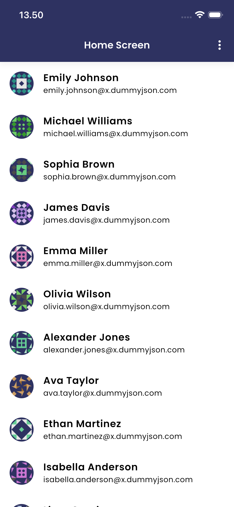
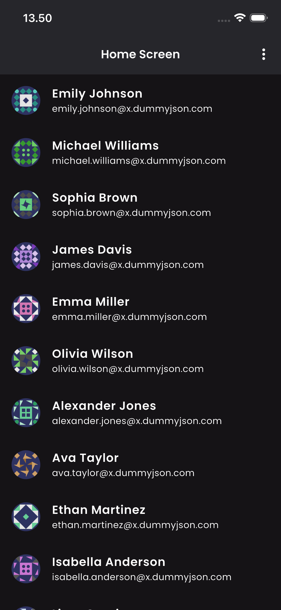

# Flutter Monorepo

Ini adalah template **Flutter monorepo** yang menggunakan **Melos** dan **Dart pub workspace**.

Semua packages (core, shared, features) dikelola dalam satu repository. Versi dependency cukup ditulis **satu kali** di root — semua packages otomatis mengikuti.

**Tech Stack:**
- 🗂 [Melos](https://melos.invertase.io/) — monorepo management & scripts
- 🔀 [auto_route](https://pub.dev/packages/auto_route) — routing & code generation
- 🧊 [freezed](https://pub.dev/packages/freezed) — immutable models
- 💉 [get_it](https://pub.dev/packages/get_it) — dependency injection
- 🧩 [flutter_bloc](https://pub.dev/packages/flutter_bloc) — state management
- 🖼 [flutter_gen](https://pub.dev/packages/flutter_gen) — type-safe assets

---

## 📁 Struktur Project

```
flutter_monorepo/
├── pubspec.yaml          ← semua versi dependency terpusat di sini
├── melos.yaml            ← konfigurasi Melos & scripts
├── Makefile              ← shortcut commands
├── tools/
│   └── create_feature.sh ← script generator feature baru
├── apps/
│   └── mobile_app/       ← Flutter app (entry point)
│       └── lib/
│           ├── routing/  ← AppRouter (assembles semua feature routes)
│           └── injection/← GetIt setup
└── packages/
    ├── core/             ← network, base repository, utils (pure Dart)
    ├── config/           ← konstanta app (ukuran, warna, setting)
    ├── shared_ui/        ← reusable widgets, theme, dan assets
    ├── shared_extension/ ← Dart/Flutter extension methods
    └── features/         ← satu folder per fitur bisnis
        ├── theme/
        ├── user/
        └── ...
```

> Setiap **feature** adalah Flutter package tersendiri dengan struktur DDD (domain, infrastructure, presentation) dan router-nya sendiri.

---

## ⚙️ Setup Awal

### 1. Install Melos (sekali saja)

```bash
dart pub global activate melos
```

### 2. Install semua dependencies

```bash
# Jalankan dari root monorepo
flutter pub get
```

> Karena menggunakan Dart pub workspace, `flutter pub get` di root otomatis men-sync **semua packages** sekaligus.

---

## 🚀 Jalankan App

```bash
# Shortcut via Makefile
make run-mobile

# Atau pilih device tertentu
cd apps/mobile_app && flutter run -d <device_id>
```

---

## 📱 Preview

<p align="center">
  
  &nbsp;&nbsp;&nbsp;
  
</p>

---

## 🏗️ Build Runner (Code Generation)

Build runner digunakan untuk generate kode dari annotation (`@RoutePage`, `@freezed`, dll) dan asset.

```bash
# Generate semua packages sekaligus (dari root)
melos run build

# Atau hanya satu package
cd packages/features/user
dart run build_runner build --delete-conflicting-outputs
```

**Kapan perlu dijalankan?**

| Kondisi | Perlu build? |
|---|---|
| Tambah `@RoutePage()` baru | ✅ |
| Tambah `@freezed` / `@JsonSerializable` | ✅ |
| Tambah asset baru ke `shared_ui/assets/` | ✅ |
| Edit UI / logika biasa | ❌ |

---

## 🖼️ Assets

Semua asset (icon, gambar) disimpan di `packages/shared_ui/assets/` dan sudah di-export melalui `shared_ui` — tidak perlu package tambahan.

### Struktur folder asset

```
packages/shared_ui/assets/
├── icons/    ← .png, .svg
└── images/   ← .png, .jpg
```

### Tambah asset baru

```bash
# 1. Taruh file di folder yang sesuai
cp icon_baru.png packages/shared_ui/assets/icons/icon_baru.png

# 2. Regenerate
melos run build
```

### Pakai di widget

Karena `shared_ui` sudah jadi dependency di setiap feature, langsung pakai tanpa import tambahan:

```dart
import 'package:shared_ui/shared_ui.dart';

// Tampilkan sebagai Image widget
Assets.icons.iconBaru.image(width: 24)
Assets.images.logoFull.image(fit: BoxFit.cover)

// Sebagai ImageProvider (untuk DecorationImage, CircleAvatar, dll)
DecorationImage(image: Assets.images.logoFull.provider())
```

---

## 📦 Buat Package Baru

Gunakan ini kalau ingin tambah shared package baru (bukan feature).

**Dart package** — tanpa Flutter (contoh: `core`, `shared_extension`):
```bash
cd packages
dart create -t package-simple <nama> --force
```

**Flutter package** — butuh Flutter SDK (contoh: `shared_ui`, `config`):
```bash
cd packages
flutter create --template=package <nama>
```

Setelah dibuat, **edit `pubspec.yaml`** hasil generate:

```yaml
name: <nama>
resolution: workspace       # ← wajib ditambahkan

environment:
  sdk: ^3.9.2

dependencies:
  dio:                      # ← tulis tanpa versi, ikut root
  flutter_bloc:

dev_dependencies:
  lints:
  build_runner:
```

Lalu daftarkan di root `pubspec.yaml`:
```yaml
workspace:
  - packages/<nama>         # ← tambahkan
```

```bash
flutter pub get
```

---

## 🚀 Buat Feature Baru

Feature adalah Flutter package dengan struktur DDD + routing sendiri. Cukup jalankan satu command:

```bash
melos run create:feature -- <feature_name>

# Contoh
melos run create:feature -- product
melos run create:feature -- product_order   # snake_case → PascalCase otomatis
```

Script otomatis membuat:
- ✅ Folder DDD lengkap (`entities`, `repositories`, `usecase`, `datasource`, `bloc`, `page`, `routing`)
- ✅ `pubspec.yaml` dengan semua dependency yang dibutuhkan
- ✅ Template `<feature>_screen.dart` dengan `@RoutePage()`
- ✅ Template `<feature>_route.dart` dengan `@AutoRouterConfig`

Struktur yang terbuat:
```
features/<feature>/lib/
├── domain/
│   ├── entities/
│   ├── repositories/      ← abstract interface
│   └── usecase/
├── infrastructure/
│   ├── datasource/
│   └── repositories/      ← implementasi
├── presentation/
│   ├── bloc/
│   └── page/
└── routing/
```

### Setelah script selesai, lakukan 2 langkah manual:

**1. Daftarkan di root `pubspec.yaml`:**
```yaml
workspace:
  - packages/features/<feature>
```

**2. Tambahkan sebagai dependency di `apps/mobile_app/pubspec.yaml`:**
```yaml
dependencies:
  <feature>:
    path: ../../packages/features/<feature>
```

```bash
flutter pub get
```

---

## 🗺️ Setup Router Feature

Setelah feature dibuat, hubungkan routernya ke `AppRouter` di `mobile_app`.

### Cara kerjanya

Setiap feature punya **router sendiri** (`FeatureRoute`) yang menyimpan daftar screen-nya. `AppRouter` di `mobile_app` cukup **menyebar (spread)** routes dari tiap feature.

### 1. Screen sudah ada templatenya — isi saja

```dart
// lib/presentation/page/<feature>_screen.dart
@RoutePage()
class ProductScreen extends StatelessWidget {
  // ...
}
```

### 2. Router feature sudah ada templatenya — isi routes

```dart
// lib/routing/<feature>_route.dart
import 'package:auto_route/auto_route.dart';
import 'package:product/routing/product_route.gr.dart';  // ← file hasil generate

@AutoRouterConfig(replaceInRouteName: 'Screen|Page,Route')
class ProductFeatureRoute extends RootStackRouter {
  @override
  RouteType get defaultRouteType => const RouteType.cupertino();

  @override
  List<AutoRoute> get routes => [
    AutoRoute(page: ProductRoute.page, initial: true),
  ];

  @override
  List<AutoRouteGuard> get guards => [];
}
```

### 3. Generate

```bash
melos run build
# → product_route.gr.dart ter-generate
```

### 4. Daftarkan di AppRouter

```dart
// apps/mobile_app/lib/routing/route.dart
import 'package:user/routing/user_route.dart';
import 'package:product/routing/product_route.dart';  // ← tambahkan

part 'route.gr.dart';

@AutoRouterConfig(replaceInRouteName: 'Screen|Page,Route')
class AppRouter extends RootStackRouter {
  @override
  List<AutoRoute> get routes => [
    ...UserFeatureRoute().routes,
    ...ProductFeatureRoute().routes,  // ← tambahkan
  ];
}
```

```bash
melos run build   # update route.gr.dart mobile_app
make run-mobile
```

---

## 💉 Aturan Dependencies

> **Versi dependency hanya boleh ditulis di root `pubspec.yaml`.**  
> Package individual cukup tulis nama saja — versi diambil otomatis dari root.

```yaml
# ✅ Benar — di package individual
dependencies:
  auto_route:
  flutter_bloc:

# ❌ Salah — jangan tulis versi di package individual
dependencies:
  auto_route: ^11.1.0
```

Kalau butuh package baru, tambahkan versinya di root dulu, baru referensikan tanpa versi di package yang butuh.

---

## 📋 Commands

| Command | Fungsi |
|---|---|
| `flutter pub get` | Sync semua dependencies workspace |
| `make run-mobile` | Jalankan mobile app |
| `melos run build` | Code generation (build_runner semua packages) |
| `melos run create:feature -- <name>` | Buat feature baru otomatis |
| `melos run format:select` | Format semua Flutter packages |

